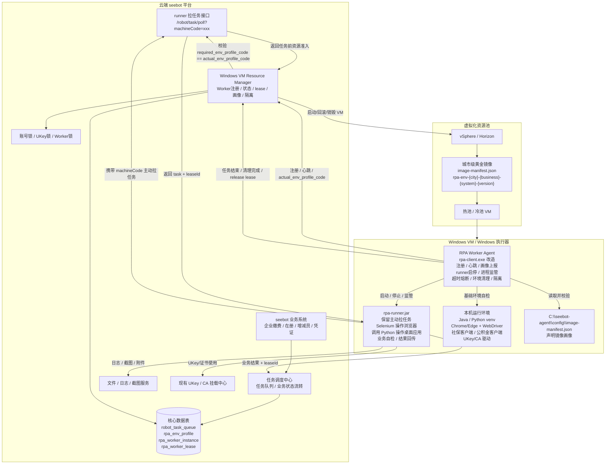
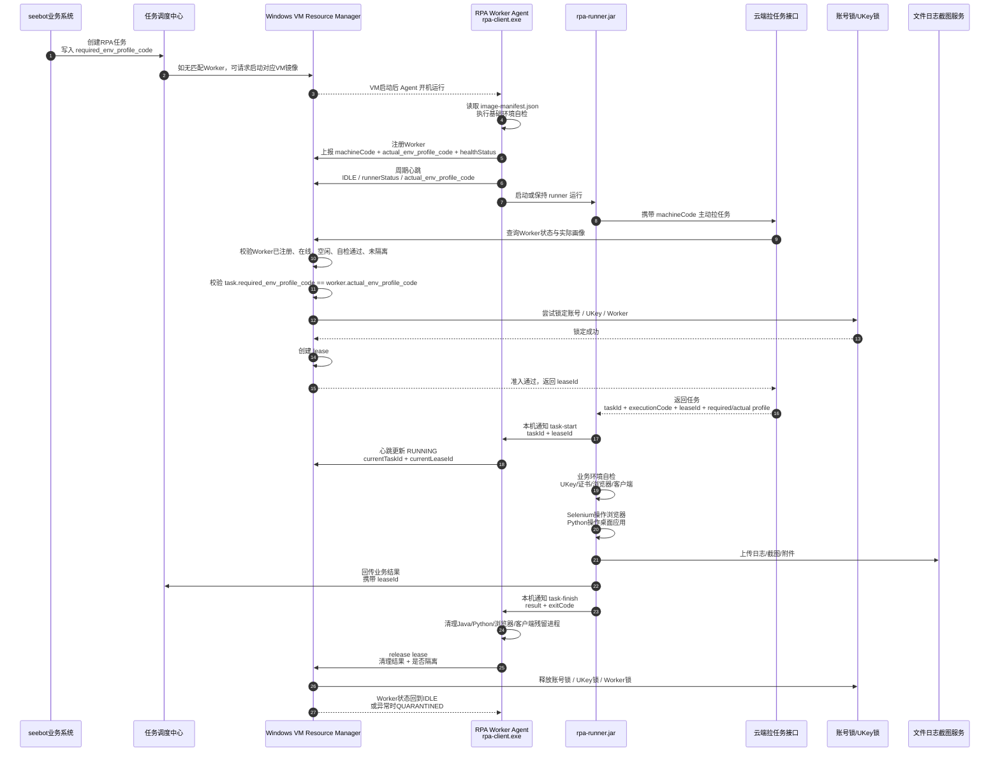

# RPA Worker Agent 改造方案

版本：V1.2  
项目名称：seebot RPA Worker Agent 改造  
适用范围：Windows RPA 执行器、rpa-client.exe、rpa-runner.jar、Windows VM Resource Manager、城市级黄金镜像、vSphere / Horizon VM 执行池  
修订日期：2026-06-05  
核心原则：保留 `rpa-runner.jar` 主动拉任务模式，通过云端任务返回前的资源准入、环境画像匹配和 lease 创建，确保任务与 VM 镜像一致。

---

## 文档修订说明

| 版本 | 说明 |
|---|---|
| V1.0 | 初版，提出将 rpa-client.exe 改造为 RPA Worker Agent |
| V1.1 | 修正为保留 rpa-runner.jar 主动拉任务模式 |
| V1.2 | 完善文档结构，补充决策摘要、边界、核心流程、实施计划、验收标准与附录 |

---

## 目录

1. 决策摘要  
2. 项目背景与现状  
3. 改造目标与边界  
4. 总体架构  
5. 核心交互流程  
6. 组件职责划分  
7. 机器唯一码与 WorkerId 设计  
8. 环境画像一致性设计  
9. runner 拉任务接口改造  
10. lease 租约机制  
11. Agent 感知 runner 当前任务  
12. 自检体系设计  
13. VM 镜像与任务一致性保障  
14. 热池与冷池下的任务拉取控制  
15. 进程形态演进设计  
16. 接口设计  
17. 数据库设计建议  
18. 本地目录与配置规范  
19. rpa-runner.jar 改造要求  
20. 异常处理与隔离机制  
21. 实施计划  
22. 验收标准  
23. 风险与应对  
24. 推荐落地路线  
25. 结论  
26. 附录  

---

# 1. 决策摘要

## 1.1 核心结论

现有 `rpa-client.exe` 可以改造为 **RPA Worker Agent**。

但是，基于当前生产执行链路，本期不建议将 `rpa-runner.jar` 的主动拉任务职责迁移到 Agent。

本期推荐方案：

```text
保留：
    rpa-runner.jar 根据 machineCode 主动向云端拉任务

增强：
    rpa-client.exe 改造为 RPA Worker Agent

新增：
    云端任务返回前的资源准入
    Worker 实际环境画像 actual_env_profile_code
    任务要求环境画像 required_env_profile_code
    lease 租约机制
    VM 镜像一致性校验
    Agent 对 runner 的监管、熔断、清理、隔离能力
```

## 1.2 一句话目标

```text
不改变 runner 主动拉任务动作，
改变云端“是否允许返回任务”的判断逻辑。
```

也就是：

```text
旧模式：
    runner 携带 machineCode 拉任务
    云端找到任务就返回

新模式：
    runner 携带 machineCode 拉任务
    云端先查 Worker 状态
    云端先查 Worker 实际环境画像
    云端筛选与该 Worker 画像匹配的任务
    云端创建 lease
    云端再返回任务
```

## 1.3 本期最重要的控制点

1. 每个任务必须写入 `required_env_profile_code`；
2. 每个 Worker / VM 注册时必须上报 `actual_env_profile_code`；
3. runner 拉任务时，云端必须校验：

```text
task.required_env_profile_code == worker.actual_env_profile_code
```

4. 任务返回给 runner 前必须先创建 `lease`；
5. runner 后续所有结果、日志、截图、异常回传都必须携带 `leaseId`；
6. Agent 必须能感知 runner 当前任务，支持超时熔断和清理；
7. VM 镜像必须包含 `image-manifest.json`，用于声明镜像画像。

---

# 2. 项目背景与现状

## 2.1 当前执行器结构

当前 seebot RPA 执行器由两个核心组件组成：

```text
Windows 执行器
    |
    |-- rpa-client.exe
    |       |-- C# WinForm 程序
    |       |-- 负责启动 rpa-runner.jar
    |       |-- 负责停止 rpa-runner.jar
    |       |-- 负责报告执行器心跳
    |
    |-- rpa-runner.jar
            |-- Java 程序
            |-- 根据本机注册唯一码主动向云端获取任务
            |-- 执行环境自检
            |-- 使用 Selenium 操作浏览器
            |-- 调用 Python 第三方库操作桌面应用
            |-- 回传任务执行结果、日志、截图、附件
```

## 2.2 当前机器唯一码机制

每台机器都有一个注册唯一码，例如：

```text
SR10-2604-8STY
SR10-2505-V61I
SR10-2302-87F5
```

当前任务拉取模式为：

```text
rpa-runner.jar
    ↓ 携带 machineCode / 机器唯一码
云端任务接口
    ↓ 返回该机器可执行任务
rpa-runner.jar
    ↓ 执行任务
云端
    ↓ 更新任务状态
```

## 2.3 当前模式的主要问题

当前模式能够支撑已有任务执行，但在执行器平台化和 VM 化后会出现以下问题：

1. 任务返回前缺少环境画像校验，可能出现任务与 VM 镜像不匹配；
2. runner 主动拉任务时，如果云端不做资源准入，可能绕过 Resource Manager；
3. Worker 是否空闲、是否健康、是否隔离，缺少统一判断；
4. 任务被 runner 获取前没有 lease，Resource Manager 无法准确知道 Worker 被占用；
5. rpa-client.exe 目前偏 WinForm 工具形态，不适合作为长期生产 Agent；
6. runner 当前任务状态与 Agent 心跳之间缺少强关联；
7. runner 卡死、超时、残留进程污染等问题缺少统一熔断和清理机制；
8. VM 镜像环境与任务要求之间缺少强约束，影响后续热池、冷池、非持久化 VM 池建设。

---

# 3. 改造目标与边界

## 3.1 总体目标

将现有 `rpa-client.exe` 从“runner 启停工具 + 心跳工具”升级为标准化 **RPA Worker Agent**。

改造后整体结构为：

```text
Windows VM / Windows 执行器
    |
    |-- RPA Worker Agent
    |       |-- 机器注册
    |       |-- Worker 心跳
    |       |-- runner 生命周期管理
    |       |-- runner 进程监管
    |       |-- 基础环境自检
    |       |-- VM 镜像画像上报
    |       |-- runner 当前任务感知
    |       |-- 超时熔断
    |       |-- 进程清理
    |       |-- 异常隔离
    |       |-- 资源释放通知
    |
    |-- rpa-runner.jar
            |-- 根据机器唯一码主动向云端拉取任务
            |-- 执行业务环境自检
            |-- Selenium 操作浏览器
            |-- Python 操作桌面应用
            |-- 执行具体 RPA 流程
            |-- 回传业务结果
```

## 3.2 本期建设范围

本期建设范围：

1. rpa-client.exe 增强为 RPA Worker Agent；
2. Worker 注册、心跳、状态上报；
3. Worker 实际环境画像上报；
4. 任务要求环境画像生成；
5. runner 拉任务接口接入 Resource Manager 准入；
6. 任务返回前创建 lease；
7. runner 回传携带 leaseId；
8. Agent 感知 runner 当前任务；
9. Agent 超时熔断和环境清理；
10. VM 镜像 manifest 标准；
11. Worker 异常隔离机制。

## 3.3 本期暂不做

本期不做或不强制做：

1. 不强制将 runner 主动拉任务迁移为 Agent 拉任务；
2. 不重写 Selenium / Python / 桌面应用自动化逻辑；
3. 不重做已有 UKey / CA 挂载中心；
4. 不重做已有日志、截图、附件回传链路；
5. 不一次性完成所有城市 VM 镜像化；
6. 不第一版做复杂的环境兼容矩阵；
7. 不第一版强制完成 Horizon 全量接入。

---

# 4. 总体架构

## 4.1 架构图



---

# 5. 核心交互流程

## 5.1 交互流程图



## 5.2 流程关键点

1. runner 仍然主动拉任务；
2. 云端拉任务接口必须调用 Resource Manager；
3. Resource Manager 负责资源准入判断；
4. 任务返回前必须创建 lease；
5. 任务返回时必须带 leaseId；
6. runner 必须把 leaseId 贯穿后续所有回传；
7. Agent 必须感知 runner 当前任务；
8. Agent 负责兜底清理和异常隔离。

---

# 6. 组件职责划分

| 组件 | 职责 |
|---|---|
| Windows VM Resource Manager | 管 Worker 注册、Worker 状态、环境画像、lease、UKey/账号锁、VM 回滚/销毁、异常隔离 |
| rpa-client.exe / RPA Worker Agent | 管机器、管 runner、管心跳、管基础自检、管进程、管清理、管隔离 |
| rpa-runner.jar | 主动拉任务、执行业务自检、执行 RPA 流程、回传任务结果 |
| 云端任务调度中心 | 管任务队列、业务状态流转、任务筛选 |
| 云端任务拉取接口 | 在返回任务前调用 Resource Manager 做资源准入 |
| Python 桌面脚本 | 操作桌面应用、图片识别、窗口点击、输入模拟 |
| WinForm UI | 运维查看、手工启停、状态展示、调试工具 |
| UKey/CA 挂载中心 | 提供现有 UKey/CA 挂载、卸载、证书访问能力 |
| 文件/日志/截图服务 | 存储执行日志、截图、附件、凭证等执行产物 |

---

# 7. 机器唯一码与 WorkerId 设计

## 7.1 保留原机器唯一码

当前每台机器已有注册唯一码，建议继续保留，不直接废弃。

原因：

1. 历史任务记录已经绑定机器编码；
2. 异常统计已经按机器编码归因；
3. runner 已经依赖机器唯一码拉任务；
4. 短期改造成本最低；
5. 便于追溯历史执行记录。

## 7.2 推荐映射方式

建议新增 Worker 概念，但保留 machineCode。

```text
worker_id = WORKER-SUZHOU-SOCIAL-CLIENT-001
machine_code = SR10-2604-8STY
```

第一阶段也可以直接使用：

```text
worker_id = machine_code = SR10-2604-8STY
```

推荐第一阶段先采用后一种，降低改造成本。

---

# 8. 环境画像一致性设计

## 8.1 问题

保留 runner 拉任务方式后，最大风险是：

```text
某台 VM 镜像实际是“苏州社保客户端环境”
但 runner 拉到了“广州税务网页端任务”
```

因此必须引入两类画像：

```text
任务要求画像：task_required_profile
Worker 实际画像：worker_actual_profile
```

只有两者匹配，云端才允许返回任务。

## 8.2 任务要求画像

每个任务创建时，必须写入任务所需环境。

示例：

```json
{
  "taskId": 123456,
  "taskType": "PAY_FEE_GET",
  "cityCode": "suzhou",
  "businessType": "SOCIAL",
  "declareSystem": "SOCIAL_CLIENT",
  "needWindows": true,
  "needDesktop": true,
  "needUkey": true,
  "needCa": true,
  "browserType": "edge",
  "clientName": "社保费管理客户端",
  "requiredEnvProfileCode": "rpa-env-suzhou-social-client-202606"
}
```

任务表建议增加字段：

```sql
ALTER TABLE robot_task_queue
ADD COLUMN required_env_profile_code VARCHAR(100) COMMENT '任务要求的环境画像',
ADD COLUMN required_city_code VARCHAR(50) COMMENT '任务要求城市',
ADD COLUMN required_business_type VARCHAR(50) COMMENT '任务要求业务类型',
ADD COLUMN required_declare_system VARCHAR(100) COMMENT '任务要求申报系统',
ADD COLUMN required_need_ukey TINYINT DEFAULT 0 COMMENT '是否需要UKey',
ADD COLUMN required_need_desktop TINYINT DEFAULT 1 COMMENT '是否需要Windows桌面',
ADD COLUMN assigned_worker_id VARCHAR(100) COMMENT '分配Worker',
ADD COLUMN lease_id VARCHAR(100) COMMENT '资源租约ID',
ADD COLUMN resource_match_status VARCHAR(50) COMMENT '资源匹配状态';
```

## 8.3 Worker 实际环境画像

Agent 启动后必须上报当前机器或 VM 的实际环境画像。

示例：

```json
{
  "workerId": "SR10-2604-8STY",
  "machineCode": "SR10-2604-8STY",
  "vmName": "rpa-suzhou-social-client-001",
  "actualEnvProfileCode": "rpa-env-suzhou-social-client-202606",
  "imageCode": "rpa-env-suzhou-social-client",
  "imageVersion": "202606",
  "cityCode": "suzhou",
  "businessType": "SOCIAL",
  "declareSystem": "SOCIAL_CLIENT",
  "needWindows": true,
  "needDesktop": true,
  "supportUkey": true,
  "supportCa": true,
  "browserType": "edge",
  "browserVersion": "124.0.xxx",
  "clientName": "社保费管理客户端",
  "clientVersion": "x.x.x",
  "agentVersion": "2.0.0",
  "runnerVersion": "1.8.5",
  "healthStatus": "PASS"
}
```

## 8.4 镜像 Manifest 文件

每个城市黄金镜像中应包含固定 manifest 文件。

路径：

```text
C:\seebot-agent\config\image-manifest.json
```

内容示例：

```json
{
  "envProfileCode": "rpa-env-suzhou-social-client-202606",
  "imageCode": "rpa-env-suzhou-social-client",
  "imageVersion": "202606",
  "cityCode": "suzhou",
  "businessType": "SOCIAL",
  "declareSystem": "SOCIAL_CLIENT",
  "browserType": "edge",
  "browserVersion": "124.0.xxx",
  "clientName": "社保费管理客户端",
  "clientVersion": "x.x.x",
  "caDriverVersion": "x.x.x",
  "ukeyDriverVersion": "x.x.x",
  "agentVersion": "2.0.0",
  "runnerVersion": "1.8.5",
  "buildTime": "2026-06-05 10:00:00"
}
```

注意：

```text
image-manifest.json 只是声明
Agent 实际检测结果才是最终依据
```

Agent 注册时应同时上报：

```text
manifest 声明画像
实际检测画像
最终 actual_env_profile_code
```

---

# 9. runner 拉任务接口改造

## 9.1 当前拉任务模式

```http
GET /robot/task/poll?machineCode=SR10-2604-8STY
```

旧逻辑：

```text
1. 根据 machineCode 找任务
2. 有任务就返回
```

## 9.2 改造后拉任务模式

新逻辑：

```text
1. 根据 machineCode 查询 Worker
2. 判断 Worker 是否已注册
3. 判断 Worker 是否在线
4. 判断 Worker 是否空闲
5. 判断 Worker 是否已通过自检
6. 判断 Worker 是否被隔离
7. 获取 Worker 的 actual_env_profile_code
8. 查询 required_env_profile_code 与 actual_env_profile_code 匹配的任务
9. 判断账号锁是否可用
10. 判断 UKey 锁是否可用
11. 创建 lease
12. 返回任务给 runner
```

## 9.3 云端任务返回前准入规则

只有满足以下条件，才允许返回任务：

```text
1. Worker 已注册
2. Worker 心跳正常
3. Worker 状态为 IDLE
4. Worker 未被隔离
5. runner 状态正常
6. Worker 当前没有未释放 lease
7. Worker 自检状态为 PASS
8. task.required_env_profile_code == worker.actual_env_profile_code
9. 账号锁可用
10. UKey 锁可用
11. 当前时间符合任务执行窗口
```

第一版建议使用强匹配：

```text
task.required_env_profile_code == worker.actual_env_profile_code
```

不要第一版就做复杂兼容矩阵。

## 9.4 拉任务返回内容

云端返回任务时必须增加 leaseId 和画像信息。

```json
{
  "hasTask": true,
  "taskId": 123456,
  "executionCode": "EXE202606050001",
  "leaseId": "LEASE-20260605-0001",
  "machineCode": "SR10-2604-8STY",
  "requiredEnvProfileCode": "rpa-env-suzhou-social-client-202606",
  "actualEnvProfileCode": "rpa-env-suzhou-social-client-202606",
  "imageVersion": "202606",
  "taskType": "PAY_FEE_GET",
  "timeoutSeconds": 3600,
  "payload": {
    "cityCode": "suzhou",
    "businessType": "SOCIAL",
    "declareSystem": "SOCIAL_CLIENT",
    "accountId": 10086,
    "needUkey": true
  }
}
```

runner 后续所有状态回传必须携带：

```text
taskId
executionCode
machineCode
leaseId
```

---

# 10. lease 租约机制

## 10.1 lease 创建时机

由于本期保留 runner 主动拉任务，因此 lease 的创建时机必须调整。

错误做法：

```text
runner 已经拿到任务并开始执行
Resource Manager 之后才知道机器被占用
```

正确做法：

```text
runner 请求任务
    ↓
云端筛选候选任务
    ↓
云端调用 Resource Manager 做资源准入
    ↓
Resource Manager 创建 lease
    ↓
lease 创建成功
    ↓
云端返回任务给 runner
```

也就是说：

```text
任务返回给 runner 之前，必须先创建 lease
```

## 10.2 lease 生命周期

```text
REQUESTED
    ↓
ALLOCATED
    ↓
RUNNING
    ↓
SUCCESS / FAILED / TIMEOUT / CANCELLED
    ↓
RELEASED
```

## 10.3 lease 释放时机

以下场景必须释放 lease：

1. runner 执行成功；
2. runner 执行失败；
3. runner 业务自检失败；
4. runner 超时；
5. Agent 强制 kill runner；
6. Worker 被隔离；
7. VM 准备回滚或销毁；
8. 任务被人工取消。

---

# 11. Agent 感知 runner 当前任务

## 11.1 推荐方案：runner 主动通知本机 Agent

runner 拉到任务后，调用本机 Agent 接口。

任务开始：

```http
POST http://127.0.0.1:18080/local/runner/task-start
```

```json
{
  "taskId": 123456,
  "executionCode": "EXE202606050001",
  "leaseId": "LEASE-20260605-0001",
  "taskType": "PAY_FEE_GET"
}
```

任务结束：

```http
POST http://127.0.0.1:18080/local/runner/task-finish
```

```json
{
  "taskId": 123456,
  "executionCode": "EXE202606050001",
  "leaseId": "LEASE-20260605-0001",
  "result": "SUCCESS",
  "exitCode": 0
}
```

优点：

1. Agent 实时知道 runner 当前任务；
2. Agent 心跳可以准确上报 currentTaskId 和 currentLeaseId；
3. Agent 可以做任务级超时熔断；
4. Agent 能在 runner 卡死时进行兜底清理和释放。

## 11.2 过渡方案：Agent 从云端查询当前任务

如果短期不想改 runner，可以让 Agent 心跳时向云端查询：

```text
machineCode=xxx 当前是否存在运行中任务？
```

优点：

1. runner 改动小；
2. 可以快速落地。

缺点：

1. 状态有延迟；
2. Agent 对 runner 的监管不够直接；
3. runner 卡死时 Agent 可能无法准确知道任务上下文。

建议：

```text
第一阶段使用云端查询过渡
第二阶段改为 runner 主动通知本机 Agent
```

---

# 12. 自检体系设计

## 12.1 Agent 基础自检

Agent 负责机器级、自身级、基础运行环境自检。

检查项：

```text
1. Java 是否存在
2. runner.jar 是否存在
3. Python 环境是否存在
4. Python 第三方库是否完整
5. Chrome / Edge 是否存在
6. ChromeDriver / EdgeDriver 是否存在
7. 浏览器与 WebDriver 版本是否匹配
8. 工作目录是否可写
9. 日志目录是否可写
10. 上传接口是否可访问
11. 当前是否有交互式桌面 Session
12. 屏幕分辨率是否正确
13. 上次残留进程是否清理
14. 磁盘空间是否足够
15. Agent 配置是否完整
16. image-manifest.json 是否存在
17. manifest 声明画像是否与实际检测一致
```

## 12.2 runner 业务自检

runner 继续负责业务级自检。

检查项：

```text
1. 目标网站是否可访问
2. 账号配置是否完整
3. UKey 是否挂载成功
4. 证书是否可枚举
5. 社保客户端是否可打开
6. 公积金客户端是否可打开
7. 城市业务入口是否可进入
8. Selenium 是否可创建浏览器会话
9. Python 桌面自动化库是否可调用
10. 当前任务输入参数是否完整
11. requiredEnvProfileCode 是否与本地 actualEnvProfileCode 一致
```

## 12.3 自检失败处理

Agent 基础自检失败：

```text
1. 不允许 Worker 接任务
2. Worker 状态标记为 ERROR 或 QUARANTINED
3. 云端任务拉取接口不返回任务
4. 记录 ENV_CHECK_FAILED
5. 通知运维处理
```

runner 业务自检失败：

```text
1. runner 回传业务自检失败
2. Agent 收集日志和截图
3. 释放 lease
4. Worker 清理后回到 IDLE 或进入 QUARANTINED
```

画像不一致：

```text
1. 不执行任务
2. 回传 ENV_PROFILE_MISMATCH
3. 释放 lease
4. Worker 标记为 QUARANTINED
```

---

# 13. VM 镜像与任务一致性保障

## 13.1 三层校验

第一层：任务创建时写入 `required_env_profile_code`。

第二层：Agent 注册时上报 `actual_env_profile_code`。

第三层：任务返回前强匹配：

```text
task.required_env_profile_code == worker.actual_env_profile_code
```

## 13.2 不一致场景处理

任务画像和 Worker 画像不一致：

```text
1. 不返回任务
2. 记录 RESOURCE_PROFILE_NOT_MATCH
3. 任务继续等待匹配 Worker
4. 如长期无匹配 Worker，触发冷池启动
```

VM 期望画像与实际画像不一致：

```text
1. Worker 标记 QUARANTINED
2. 禁止 runner 拉任务
3. 通知 Resource Manager 回滚或销毁 VM
4. 记录 IMAGE_PROFILE_MISMATCH
```

镜像名匹配但自检失败：

```text
1. Worker 标记 ERROR 或 QUARANTINED
2. 云端不返回任务
3. 如是热池 VM，剔出热池
4. 如是冷池 VM，销毁并重新创建
```

---

# 14. 热池与冷池下的任务拉取控制

## 14.1 热池

热池 VM 长期在线，runner 会周期性拉任务。

因此热池必须按环境画像分池。

示例：

```text
苏州社保客户端热池：
    Worker-001 actual_env_profile_code = rpa-env-suzhou-social-client-202606
    Worker-002 actual_env_profile_code = rpa-env-suzhou-social-client-202606

广州税务网页端热池：
    Worker-003 actual_env_profile_code = rpa-env-guangzhou-social-taxweb-202606
    Worker-004 actual_env_profile_code = rpa-env-guangzhou-social-taxweb-202606
```

云端任务接口按 `actual_env_profile_code` 过滤任务：

```text
苏州社保客户端 VM 只能拉到苏州社保客户端任务
广州税务网页端 VM 只能拉到广州税务网页端任务
```

## 14.2 冷池

冷池适合“任务先出现，再启动对应 VM”。

流程：

```text
1. 云端产生待执行任务
2. 任务带 required_env_profile_code
3. Resource Manager 发现没有匹配 Worker
4. Resource Manager 根据 required_env_profile_code 启动对应 VM 镜像
5. VM 启动后 Agent 注册 actual_env_profile_code
6. Resource Manager 校验 actual == required
7. Worker 状态变成 IDLE
8. runner 开始拉任务
9. 云端只把 matching profile 的任务返回给它
```

---

# 15. 进程形态演进设计

## 15.1 短期形态

短期可以继续使用现有 `rpa-client.exe`，在其内部增强 Agent 能力。

```text
rpa-client.exe
    |-- WinForm UI
    |-- Worker 注册
    |-- 心跳上报
    |-- runner 启停
    |-- runner 进程监管
    |-- 基础环境自检
    |-- 环境画像上报
    |-- 环境清理
```

## 15.2 中期形态

抽出核心类库。

```text
Seebot.Agent.Core.dll
    |-- RegisterService
    |-- HeartbeatService
    |-- LeaseService
    |-- RunnerProcessManager
    |-- HealthCheckService
    |-- CleanupService
    |-- ImageProfileService
    |-- LogUploadService
    |-- UKeyMountAdapter

rpa-client.exe
    |-- 引用 Seebot.Agent.Core.dll
    |-- 作为 WinForm 运维界面

Seebot.Agent.Service.exe
    |-- 引用 Seebot.Agent.Core.dll
    |-- 作为生产常驻服务
```

## 15.3 长期形态

```text
Seebot.Agent.Service.exe
    |-- Windows Service
    |-- 注册 / 心跳 / 租约状态同步
    |-- runner 管理
    |-- 状态上报
    |-- 环境清理
    |-- 资源释放

Seebot.Agent.DesktopLauncher.exe
    |-- 在交互式桌面 Session 启动 runner
    |-- 避免 Session 0 桌面自动化问题

rpa-client.exe
    |-- WinForm 运维面板

rpa-runner.jar
    |-- 主动拉任务
    |-- 执行业务流程
```

---

# 16. 接口设计

## 16.1 Worker 注册接口

```http
POST /api/rpa/worker/register
```

请求：

```json
{
  "workerId": "SR10-2604-8STY",
  "machineCode": "SR10-2604-8STY",
  "workerName": "苏州社保客户端执行器01",
  "hostName": "RPA-SUZHOU-001",
  "ip": "10.10.20.15",
  "actualEnvProfileCode": "rpa-env-suzhou-social-client-202606",
  "imageCode": "rpa-env-suzhou-social-client",
  "imageVersion": "202606",
  "agentVersion": "2.0.0",
  "runnerVersion": "1.8.5",
  "javaVersion": "1.8.0_351",
  "pythonVersion": "3.9.13",
  "osVersion": "Windows 10 LTSC",
  "screenResolution": "1920x1080",
  "healthStatus": "PASS",
  "loginSessionReady": true
}
```

响应：

```json
{
  "success": true,
  "workerId": "SR10-2604-8STY",
  "status": "REGISTERED",
  "serverTime": "2026-06-05 10:00:00"
}
```

## 16.2 Worker 心跳接口

```http
POST /api/rpa/worker/heartbeat
```

请求：

```json
{
  "workerId": "SR10-2604-8STY",
  "machineCode": "SR10-2604-8STY",
  "status": "RUNNING",
  "runnerStatus": "RUNNING",
  "actualEnvProfileCode": "rpa-env-suzhou-social-client-202606",
  "currentTaskId": 123456,
  "currentLeaseId": "LEASE-20260605-0001",
  "cpuUsage": 35.2,
  "memoryUsage": 61.5,
  "diskFreeGb": 42,
  "lastHealthCheckStatus": "PASS",
  "timestamp": "2026-06-05 10:05:00"
}
```

## 16.3 runner 拉任务接口

```http
GET /robot/task/poll?machineCode=SR10-2604-8STY
```

处理逻辑：

```text
1. 查询 Worker
2. 校验 Worker 状态
3. 获取 actual_env_profile_code
4. 筛选 required_env_profile_code 匹配任务
5. 创建 lease
6. 返回任务
```

响应：

```json
{
  "hasTask": true,
  "taskId": 123456,
  "executionCode": "EXE202606050001",
  "leaseId": "LEASE-20260605-0001",
  "machineCode": "SR10-2604-8STY",
  "requiredEnvProfileCode": "rpa-env-suzhou-social-client-202606",
  "actualEnvProfileCode": "rpa-env-suzhou-social-client-202606",
  "taskType": "PAY_FEE_GET",
  "timeoutSeconds": 3600,
  "payload": {
    "cityCode": "suzhou",
    "businessType": "SOCIAL",
    "declareSystem": "SOCIAL_CLIENT",
    "accountId": 10086,
    "needUkey": true
  }
}
```

## 16.4 runner 本机任务开始通知

```http
POST http://127.0.0.1:18080/local/runner/task-start
```

请求：

```json
{
  "taskId": 123456,
  "executionCode": "EXE202606050001",
  "leaseId": "LEASE-20260605-0001",
  "taskType": "PAY_FEE_GET"
}
```

## 16.5 runner 本机任务完成通知

```http
POST http://127.0.0.1:18080/local/runner/task-finish
```

请求：

```json
{
  "taskId": 123456,
  "executionCode": "EXE202606050001",
  "leaseId": "LEASE-20260605-0001",
  "result": "SUCCESS",
  "exitCode": 0
}
```

## 16.6 资源释放接口

```http
POST /api/rpa/resource/release
```

请求：

```json
{
  "workerId": "SR10-2604-8STY",
  "machineCode": "SR10-2604-8STY",
  "leaseId": "LEASE-20260605-0001",
  "taskId": 123456,
  "result": "SUCCESS",
  "runnerExitCode": 0,
  "cleanupStatus": "SUCCESS",
  "needQuarantine": false
}
```

---

# 17. 数据库设计建议

## 17.1 环境画像表

```sql
CREATE TABLE rpa_env_profile (
    id BIGINT PRIMARY KEY AUTO_INCREMENT,
    profile_code VARCHAR(100) NOT NULL,
    city_code VARCHAR(50) NOT NULL,
    city_name VARCHAR(100),
    business_type VARCHAR(50) NOT NULL,
    declare_system VARCHAR(100) NOT NULL,
    need_windows TINYINT DEFAULT 1,
    need_desktop TINYINT DEFAULT 1,
    need_ukey TINYINT DEFAULT 0,
    need_ca TINYINT DEFAULT 0,
    browser_type VARCHAR(50),
    browser_version VARCHAR(100),
    client_name VARCHAR(200),
    client_version VARCHAR(100),
    ca_driver_version VARCHAR(100),
    ukey_driver_version VARCHAR(100),
    vm_template_code VARCHAR(100),
    image_version VARCHAR(100),
    status VARCHAR(30) DEFAULT 'stable',
    create_time DATETIME DEFAULT CURRENT_TIMESTAMP,
    update_time DATETIME DEFAULT CURRENT_TIMESTAMP ON UPDATE CURRENT_TIMESTAMP,
    UNIQUE KEY uk_profile_code (profile_code)
);
```

## 17.2 Worker 实例表

```sql
CREATE TABLE rpa_worker_instance (
    id BIGINT PRIMARY KEY AUTO_INCREMENT,
    worker_id VARCHAR(100) NOT NULL,
    machine_code VARCHAR(100) NOT NULL,
    worker_name VARCHAR(200),
    host_name VARCHAR(200),
    ip VARCHAR(100),

    vm_name VARCHAR(200),
    expected_env_profile_code VARCHAR(100),
    actual_env_profile_code VARCHAR(100),
    image_code VARCHAR(100),
    image_version VARCHAR(100),

    os_version VARCHAR(200),
    screen_resolution VARCHAR(50),
    agent_version VARCHAR(100),
    runner_version VARCHAR(100),
    java_version VARCHAR(100),
    python_version VARCHAR(100),

    status VARCHAR(50) NOT NULL,
    runner_status VARCHAR(50),
    health_status VARCHAR(50),

    current_task_id BIGINT,
    current_lease_id VARCHAR(100),

    last_heartbeat_time DATETIME,
    last_health_check_time DATETIME,
    last_health_check_status VARCHAR(50),

    consecutive_fail_count INT DEFAULT 0,
    total_run_count INT DEFAULT 0,

    create_time DATETIME DEFAULT CURRENT_TIMESTAMP,
    update_time DATETIME DEFAULT CURRENT_TIMESTAMP ON UPDATE CURRENT_TIMESTAMP,

    UNIQUE KEY uk_worker_id (worker_id),
    KEY idx_machine_code (machine_code),
    KEY idx_actual_profile_status (actual_env_profile_code, status),
    KEY idx_heartbeat (last_heartbeat_time)
);
```

## 17.3 Worker 租约表

```sql
CREATE TABLE rpa_worker_lease (
    id BIGINT PRIMARY KEY AUTO_INCREMENT,
    lease_id VARCHAR(100) NOT NULL,
    task_id BIGINT NOT NULL,
    execution_code VARCHAR(100),
    worker_id VARCHAR(100) NOT NULL,
    machine_code VARCHAR(100),

    required_env_profile_code VARCHAR(100),
    actual_env_profile_code VARCHAR(100),

    account_id BIGINT,
    ukey_id BIGINT,
    lease_token VARCHAR(200),

    status VARCHAR(50) NOT NULL,

    request_time DATETIME,
    allocated_time DATETIME,
    start_time DATETIME,
    finish_time DATETIME,
    expire_time DATETIME,

    runner_exit_code INT,
    error_code VARCHAR(100),
    error_message VARCHAR(1000),

    create_time DATETIME DEFAULT CURRENT_TIMESTAMP,
    update_time DATETIME DEFAULT CURRENT_TIMESTAMP ON UPDATE CURRENT_TIMESTAMP,

    UNIQUE KEY uk_lease_id (lease_id),
    KEY idx_task (task_id),
    KEY idx_worker (worker_id),
    KEY idx_machine_code (machine_code),
    KEY idx_status_expire (status, expire_time)
);
```

## 17.4 Worker 自检记录表

```sql
CREATE TABLE rpa_worker_health_check (
    id BIGINT PRIMARY KEY AUTO_INCREMENT,
    worker_id VARCHAR(100) NOT NULL,
    machine_code VARCHAR(100),
    lease_id VARCHAR(100),
    task_id BIGINT,

    check_item VARCHAR(100) NOT NULL,
    check_status VARCHAR(30) NOT NULL,
    check_message VARCHAR(1000),
    detail_json TEXT,

    check_time DATETIME DEFAULT CURRENT_TIMESTAMP,

    KEY idx_worker_time (worker_id, check_time),
    KEY idx_machine_time (machine_code, check_time),
    KEY idx_lease (lease_id),
    KEY idx_status (check_status)
);
```

---

# 18. 本地目录与配置规范

## 18.1 Agent 本地目录规范

```text
C:\seebot-agent
    |-- config
    |   |-- agent.json
    |   |-- image-manifest.json
    |
    |-- logs
    |   |-- agent
    |   |-- runner
    |
    |-- workspace
    |   |-- {taskId}
    |       |-- input.json
    |       |-- output.json
    |       |-- screenshots
    |       |-- downloads
    |       |-- logs
    |
    |-- temp
    |-- tools

C:\seebot-runtime
    |-- java
    |-- python-venv
    |-- runner
    |   |-- rpa-runner.jar
    |-- scripts
    |-- drivers
    |-- clients
```

## 18.2 Agent 本地配置

`C:\seebot-agent\config\agent.json`

```json
{
  "workerId": "SR10-2604-8STY",
  "machineCode": "SR10-2604-8STY",
  "workerName": "苏州社保客户端执行器01",
  "resourceManagerUrl": "http://seebot-resource-manager",

  "javaPath": "C:\\seebot-runtime\\java\\bin\\java.exe",
  "runnerJarPath": "C:\\seebot-runtime\\runner\\rpa-runner.jar",
  "pythonPath": "C:\\seebot-runtime\\python-venv\\Scripts\\python.exe",

  "workspaceDir": "C:\\seebot-agent\\workspace",
  "agentLogDir": "C:\\seebot-agent\\logs\\agent",
  "runnerLogDir": "C:\\seebot-agent\\logs\\runner",

  "heartbeatIntervalSeconds": 15,
  "maxRunnerAliveMinutes": 60,
  "enableAutoRestart": true,
  "enableCleanupAfterTask": true,
  "enableKillProcessOnTimeout": true,
  "enableImageProfileCheck": true
}
```

---

# 19. rpa-runner.jar 改造要求

保留 runner 主动拉任务，但需要补充以下能力。

## 19.1 拉任务时继续携带 machineCode

```http
GET /robot/task/poll?machineCode=SR10-2604-8STY
```

## 19.2 接收并保存 leaseId

runner 拉到任务后，必须保存：

```text
taskId
executionCode
machineCode
leaseId
requiredEnvProfileCode
actualEnvProfileCode
timeoutSeconds
```

## 19.3 所有任务回传携带 leaseId

包括：

1. 任务开始；
2. 任务执行中；
3. 任务成功；
4. 任务失败；
5. 任务超时；
6. 环境自检失败；
7. 截图上传；
8. 附件上传；
9. 业务异常回传。

## 19.4 runner 启动任务前校验画像

runner 本地读取：

```text
C:\seebot-agent\config\image-manifest.json
```

或调用本地 Agent 查询实际画像。

如果：

```text
requiredEnvProfileCode != actualEnvProfileCode
```

则：

```text
1. 不执行任务
2. 回传 ENV_PROFILE_MISMATCH
3. 通知本机 Agent
4. 释放 lease
```

## 19.5 通知本机 Agent 当前任务

推荐新增本机 HTTP 通知。

任务开始：

```http
POST http://127.0.0.1:18080/local/runner/task-start
```

任务结束：

```http
POST http://127.0.0.1:18080/local/runner/task-finish
```

---

# 20. 异常处理与隔离机制

## 20.1 Worker 异常类型

| 异常类型 | 说明 | 处理方式 |
|---|---|---|
| WORKER_OFFLINE | Worker 心跳超时 | 标记离线，不返回任务 |
| ENV_CHECK_FAILED | Agent 基础自检失败 | 标记 ERROR 或 QUARANTINED |
| IMAGE_PROFILE_MISMATCH | VM 期望画像与实际画像不一致 | 标记 QUARANTINED |
| RESOURCE_PROFILE_NOT_MATCH | 任务画像与 Worker 画像不匹配 | 不返回任务 |
| RUNNER_TIMEOUT | runner 执行超时 | Agent kill runner，释放 lease |
| RUNNER_EXITED_ABNORMAL | runner 异常退出 | 收集日志，释放 lease |
| UKEY_LOCK_FAILED | UKey 锁定失败 | 不返回该任务 |
| ACCOUNT_LOCK_FAILED | 账号锁定失败 | 不返回该任务 |
| CLEANUP_FAILED | 执行后清理失败 | Worker 进入 ERROR 或 QUARANTINED |

## 20.2 隔离规则

以下情况建议将 Worker 标记为 `QUARANTINED`：

1. 镜像画像不一致；
2. Agent 基础自检连续失败；
3. runner 连续异常退出；
4. 同一 Worker 连续任务超时；
5. 清理残留进程失败；
6. UKey/证书连续不可用；
7. 浏览器或 WebDriver 版本不匹配；
8. 社保客户端或公积金客户端缺失；
9. manifest 缺失或与实际环境不一致。

## 20.3 隔离后处理

```text
1. 禁止该 Worker 获取任务
2. 保留最近任务日志、截图、自检结果
3. 通知运维检查
4. 热池 VM 剔出热池
5. 冷池 VM 销毁重建
6. 固定物理机需人工修复后重新启用
```

---

# 21. 实施计划

## 阶段一：Worker 纳管

周期建议：1～2 周

工作内容：

1. rpa-client.exe 增加 Worker 注册；
2. rpa-client.exe 增加 Worker 心跳；
3. 心跳增加 runnerStatus；
4. 心跳增加 machineCode；
5. 心跳增加 actualEnvProfileCode；
6. Resource Manager 增加 Worker 注册接口；
7. Resource Manager 增加 Worker 心跳接口；
8. 建立 rpa_worker_instance 表；
9. 可查询 Worker 在线、离线、空闲、运行、异常状态。

交付物：

1. Worker 注册接口；
2. Worker 心跳接口；
3. rpa-client.exe Agent 协议版本；
4. Worker 状态查询接口；
5. Worker 管理页面或运维查询 SQL。

## 阶段二：任务拉取接口增加资源准入

周期建议：2 周

工作内容：

1. 任务表增加 required_env_profile_code；
2. Worker 表增加 actual_env_profile_code；
3. runner 拉任务接口接入 Resource Manager；
4. 返回任务前校验 Worker 状态；
5. 返回任务前校验环境画像；
6. 返回任务前校验账号锁；
7. 返回任务前校验 UKey 锁；
8. 返回任务前创建 lease；
9. 拉任务响应增加 leaseId。

交付物：

1. 改造后的任务拉取接口；
2. rpa_worker_lease 表；
3. Resource Manager 资源准入逻辑；
4. lease 创建逻辑；
5. 画像匹配逻辑。

## 阶段三：Agent 监管 runner

周期建议：1～2 周

工作内容：

1. rpa-client.exe 监控 runner 进程；
2. Agent 心跳上报 currentTaskId；
3. Agent 心跳上报 currentLeaseId；
4. runner 通知 Agent task-start；
5. runner 通知 Agent task-finish；
6. Agent 实现 runner 超时熔断；
7. Agent 实现残留进程清理。

交付物：

1. 本机 Agent HTTP 接口；
2. runner task-start 通知；
3. runner task-finish 通知；
4. 超时 kill 能力；
5. 进程清理能力。

## 阶段四：VM 镜像画像一致性

周期建议：1～2 周

工作内容：

1. 城市镜像增加 image-manifest.json；
2. Agent 读取 manifest；
3. Agent 检测实际环境；
4. Agent 上报 actualEnvProfileCode；
5. 云端校验 expected 与 actual；
6. 不一致时 Worker 进入 QUARANTINED；
7. runner 执行前再次校验画像。

交付物：

1. image-manifest.json 标准；
2. Agent 画像上报能力；
3. 画像不一致隔离机制；
4. runner 本地画像校验能力。

## 阶段五：Service 化改造

周期建议：2～3 周

工作内容：

1. 抽取 Seebot.Agent.Core.dll；
2. 新增 Seebot.Agent.Service.exe；
3. 将注册、心跳、runner 管理迁移到 Service；
4. rpa-client.exe 改为运维 UI；
5. Service 支持开机自启；
6. Service 支持崩溃自动恢复；
7. UI 通过本地 IPC 或 HTTP 调用 Service 状态。

交付物：

1. Agent Core 类库；
2. Windows Service；
3. WinForm 运维界面；
4. Service 安装脚本；
5. Service 升级脚本。

## 阶段六：接入 VM 热池 / 冷池

周期建议：3～4 周

工作内容：

1. 按 required_env_profile_code 建立 VM 模板；
2. 按 actual_env_profile_code 建立热池；
3. 冷池按任务 required_env_profile_code 启动 VM；
4. VM 启动后 Agent 自动注册；
5. runner 拉任务接口按 actual_env_profile_code 过滤；
6. 任务完成后 Agent 清理环境；
7. Resource Manager 根据策略回滚、销毁或回到热池。

交付物：

1. VM 热池试点；
2. VM 冷池试点；
3. 任务与镜像一致性报告；
4. 试点城市执行报告。

---

# 22. 验收标准

## 22.1 功能验收

1. Agent 可注册 Worker；
2. Agent 可上报 machineCode；
3. Agent 可上报 actualEnvProfileCode；
4. Agent 可上报 runnerStatus；
5. runner 仍可按 machineCode 拉任务；
6. 云端任务拉取接口只返回画像匹配任务；
7. 任务返回前可创建 lease；
8. runner 回传时携带 leaseId；
9. Agent 可感知 runner 当前任务；
10. Agent 可超时熔断 runner；
11. Agent 可清理残留进程；
12. Worker 异常时可隔离；
13. Worker 画像不一致时不返回任务；
14. VM 镜像画像不一致时可隔离。

## 22.2 稳定性验收

1. Agent 连续运行 7 天无异常退出；
2. runner 异常退出后 Agent 可识别；
3. runner 超时后 Agent 可终止；
4. Java/Python/浏览器残留进程可清理；
5. RDP 断开不影响 Agent Service；
6. Windows 重启后 Agent 自动恢复；
7. Resource Manager 能准确识别 Worker 状态；
8. Worker 状态与实际 runner 状态一致。

## 22.3 镜像一致性验收

1. 苏州社保客户端 VM 只能获取苏州社保客户端任务；
2. 广州税务网页端 VM 只能获取广州税务网页端任务；
3. requiredEnvProfileCode 与 actualEnvProfileCode 不一致时不返回任务；
4. expectedEnvProfileCode 与 actualEnvProfileCode 不一致时 Worker 被隔离；
5. 镜像 manifest 缺失时 Worker 不允许接任务；
6. manifest 声明与实际检测不一致时 Worker 不允许接任务；
7. 自检失败时 Worker 不允许接任务。

## 22.4 业务兼容验收

1. 原有 runner 主动拉任务机制保留；
2. 原有 Selenium 浏览器操作不受影响；
3. 原有 Python 桌面应用操作不受影响；
4. 原有任务状态回传链路不受影响；
5. 原有日志、截图、附件回传链路不受影响；
6. 原有 UKey/CA 挂载能力可继续复用；
7. 原有机器唯一码可继续使用；
8. 历史机器维度统计不受影响。

---

# 23. 风险与应对

| 风险 | 影响 | 应对 |
|---|---|---|
| runner 继续主动拉任务，绕过 Resource Manager | 资源管理失效 | 云端任务返回前必须接入 Resource Manager 准入 |
| Worker 画像不准确 | 任务错跑到错误 VM | Agent 注册时读取 manifest，并做实际检测 |
| 任务未写 required_env_profile_code | 无法准确匹配资源 | 任务创建阶段强制生成画像 |
| VM 镜像 manifest 缺失 | 无法判断镜像身份 | manifest 缺失则 Worker 不允许接任务 |
| required 和 actual 不一致 | 任务错跑 | 不返回任务，Worker 或任务进入异常处理 |
| lease 创建滞后 | Worker 状态不准确 | 任务返回给 runner 前必须先创建 lease |
| Agent 不知道 runner 当前任务 | 无法超时熔断 | runner 通知本机 Agent task-start/task-finish |
| WinForm 作为生产 Agent 不稳定 | RDP/窗口关闭影响运行 | 中期拆分为 Windows Service |
| Service Session 0 问题 | 桌面自动化失败 | 使用 DesktopLauncher 在交互式桌面启动 runner |
| 残留进程污染后续任务 | 任务不稳定 | Agent 执行后统一清理进程和目录 |

---

# 24. 推荐落地路线

推荐按以下路线实施：

```text
第一步：
    rpa-client.exe 增加 Worker 注册、心跳、runnerStatus、actualEnvProfileCode 上报

第二步：
    任务创建时增加 requiredEnvProfileCode

第三步：
    runner 拉任务接口接入 Resource Manager 准入

第四步：
    返回任务前创建 lease，并把 leaseId 返回给 runner

第五步：
    runner 所有状态回传携带 leaseId

第六步：
    Agent 感知 runner 当前任务，支持超时熔断和清理

第七步：
    城市 VM 镜像加入 image-manifest.json

第八步：
    Agent 注册时做 manifest + 实际环境检测

第九步：
    rpa-client.exe 抽离 Core，新增 Windows Service

第十步：
    接入 VM 热池、冷池、回滚和销毁机制
```

---

# 25. 结论

在当前 seebot RPA 执行体系下，`rpa-runner.jar` 已承担根据机器唯一码主动向云端拉取任务的职责。本期不应强制迁移该职责，否则会扩大改造面并增加生产风险。

本期最合理方案是：

```text
保留 runner 主动拉任务
增强 rpa-client.exe 为 RPA Worker Agent
改造云端任务返回前的 Resource Manager 准入逻辑
用 required_env_profile_code 与 actual_env_profile_code 保证任务与 VM 镜像一致
用 lease 保证任务与 Worker 占用关系准确
```

最终职责边界为：

```text
rpa-client.exe / Agent：
    管机器、管 runner、管状态、管自检、管清理、管隔离

rpa-runner.jar：
    主动拉任务、执行业务、回传结果

Resource Manager：
    管 Worker、管画像、管 lease、管锁、管 VM 生命周期

云端任务调度中心：
    管任务队列、任务筛选、业务状态流转
```

该方案既保持现有执行链路稳定，又能逐步实现 RPA底座2.0 所需要的标准化、可编排、可隔离、可回滚、可版本化管理能力。

---

# 26. 附录

## 26.1 核心字段解释

| 字段 | 含义 |
|---|---|
| machineCode | 现有机器唯一码，runner 当前依赖它拉取任务 |
| workerId | Resource Manager 中的 Worker 标识，第一阶段可与 machineCode 相同 |
| required_env_profile_code | 任务要求环境画像 |
| actual_env_profile_code | Worker 实际环境画像 |
| leaseId | 一次任务占用一个 Worker 的资源租约 |
| image-manifest.json | VM 镜像内的环境声明文件 |
| QUARANTINED | Worker 被隔离，不允许继续接任务 |

## 26.2 推荐环境画像命名

```text
rpa-env-{city}-{business}-{system}-{version}
```

示例：

```text
rpa-env-suzhou-social-client-202606
rpa-env-guangzhou-social-taxweb-202606
rpa-env-shenzhen-housingfund-web-202606
```

## 26.3 Worker 状态建议

```text
STARTING       启动中
REGISTERED     已注册
IDLE           空闲
LEASED         已分配租约
RUNNING        执行中
CLEANING       清理中
ERROR          异常
QUARANTINED    已隔离
OFFLINE        离线
```

## 26.4 runner 状态建议

```text
STOPPED        未运行
STARTING       启动中
RUNNING        执行中
STOPPING       停止中
EXITED         已退出
TIMEOUT        已超时
ERROR          异常
```
