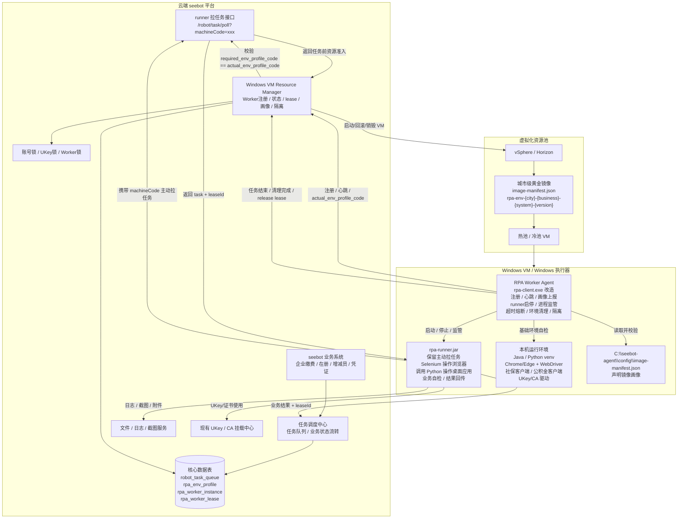
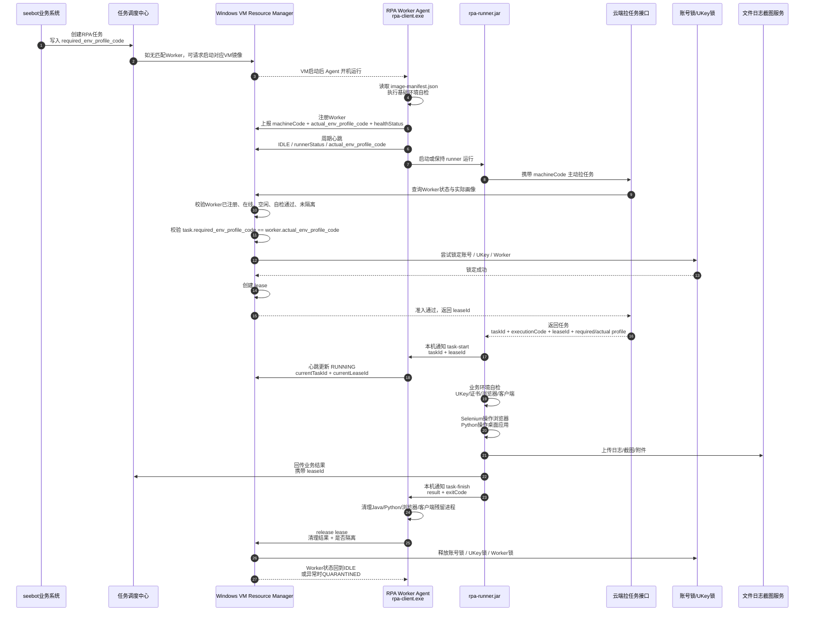

# RPA Worker Agent 架构图和交互流程图

版本：V1.0  
说明：本图基于修正后的《RPA Worker Agent改造方案》，保留 `rpa-runner.jar` 根据机器唯一码主动向云端拉取任务的机制。核心控制点放在云端任务返回前：Resource Manager 必须完成 Worker 状态校验、环境画像匹配、账号锁/UKey锁校验和 lease 创建，任务才允许返回给 runner。

---

## 一、总体架构图



---

## 二、交互流程图



---

## 三、图中关键控制点

1. `rpa-runner.jar` 继续按 `machineCode` 主动拉任务，不在第一阶段迁移为 Agent 拉任务。
2. 云端拉任务接口不能直接返回任务，必须先调用 `Windows VM Resource Manager` 做资源准入。
3. 每个任务创建时写入 `required_env_profile_code`。
4. 每个 Worker / VM 注册时上报 `actual_env_profile_code`。
5. 返回任务前必须校验：`task.required_env_profile_code == worker.actual_env_profile_code`。
6. 返回任务前必须创建 `lease`，并将 `leaseId` 返回给 runner。
7. runner 后续所有任务状态、日志、截图、附件回传都应携带 `leaseId`。
8. Agent 负责 runner 进程监管、超时熔断、残留进程清理和 Worker 异常隔离。
9. VM 镜像内需要包含 `image-manifest.json`，Agent 启动后读取并结合实际检测结果上报。
10. 热池 / 冷池 VM 必须按环境画像分池，避免不同城市、不同系统、不同客户端环境混用。

---

## 四、最小落地顺序

```text
1. rpa-client.exe 增加 Worker 注册、心跳、actual_env_profile_code 上报
2. robot_task_queue 增加 required_env_profile_code
3. 云端 runner 拉任务接口接入 Resource Manager 准入
4. 返回任务前创建 lease，响应中返回 leaseId
5. runner 所有状态回传携带 leaseId
6. runner 通知本机 Agent task-start / task-finish
7. Agent 增加超时熔断与进程清理
8. 城市 VM 镜像增加 image-manifest.json
9. Resource Manager 按画像管理热池 / 冷池
```
